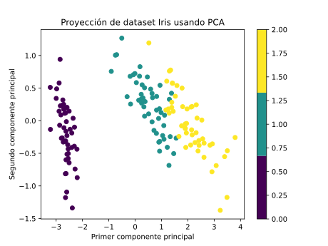
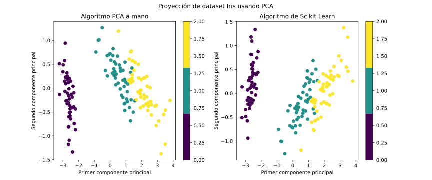
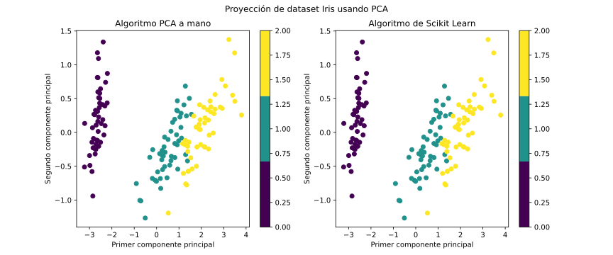

# PCA: Implementación desde cero
- En este proyecto se implementa desde cero el algoritmo PCA para reducción de dimensionalidad de datos y se comparan los resultados con la implementación de Scikit Learn.
- Como datos a estudiar se usa la base de datos Iris (plantas del genero *Iris*) para determinar las componentes principales.
- Se usan estos datos ya que la proyección a dos componentes principales logra separar las 3 distintas clases, lo que ayuda a la visualización.
- El projecto esta compuesto por dos *jupyter notebooks*:
  - **Algoritmo PCA.ipynb**: Donde se crea clase con implementación manual de PCA.
  - **Implementacion Iris Dataset.ipynb**: Se implementa el algoritmo manual sobre los datos de plantas *Iris* y se comparan resultados con la implementación de Scikit Learn.  

# Algoritmo PCA

- El algoritmo K-Means es un algoritmo no supervisado de reducción de dimensionalidad.
- Esta técnica encuentra las direcciones donde los datos tienen mayor varianza, denominadas direcciones principales.
- Al tomar los componentes de los datos proyectados en las direcciones con mayor variabilidad, se logra mantener gran cantidad de la información que diferencia los datos y a la vez reducir el número de componentes por datos (reducción de dimensionalidad).
- Debido a que se enfoca en mantener los datos diferenciados, permite mantener la estructura global de los datos al reducir el número de dimensiones.
- Al usar PCA se tiene la libertad de elegir cuantas direcciones principales utilizar, entre más direcciones se usan, más información se captura de los datos, pero a la vez aumenta el número de dimensiones.

# Detalle del Proyecto

A grandes rasgos se divide en:

- Creación de clase PCA
  - Definición de constructor
  - Definición de método *fit*
  - Definición de método *transform* 
- Importacion de datos
- Aplicación de algoritmo manual
- Aplicación de algoritmo de Scikit-Learn
- Comparación gráfica de resultados.

## Creación de clase PCA
Código en el *notebook* **Algoritmo PCA.ipynb** con líneas de código explicadas en detalle.

### Definición de constructor
Declara las variables:
 - *n_componentes*: Número de componentes a considerar (argumento de constructor)
 - *eigenvalues*: Vector con los eigenvalues de la matriz de covarianza, ordenados de mayor a menor.
 - *eigenvectors*: Matriz con los eigenvectors de la matriz de covarianza, ordenados de mayor a menor según *eigenvalues* correspondientes.
 - *promedio*: Vector con el promedio *feature* a *feature* de los datos iniciales.
 - *componentes*: Matriz con los *n_componentes eigenvectors* más importantes (mayor *eigenvalues*).

### Definición de método *fit*
- Centrar los datos, restando a cada *datapoint* el promedio *feature* a *feature*.
- Calcular la matriz de covarianza.
- Calcular los *eigenvalues* y los *eigenvectors* de la matriz de covarianza.
- Ordenar *eigenvalues* de mayor a menor.
- Ordenar los *eigenvectors* de mayor a menor segun *eigenvalue* asociado.
- Guardar en una matriz los *n_componentes eigenvectors* más influyentes.

### Definición de método *transform*
Para aplicar el algoritmo sobre datos.
- Toma como argumento los datos a transformar.
- Se proyectan los datos a *n_componentes* dimensiones multiplicandolos (producto punto) con la matriz *componentes* que contiene los *eigenvectors* que más varianza aportan a los datos.

## Implemetación de algoritmo
Código en el *notebook* **Implementacion Iris Dataset.ipynb** con líneas de código explicadas en detalle.

### Importación de datos
Se importa el *dataset Iris* con Scikit Learn.

- Esta compuesto por 150 *datapoints* correspondientes a flores de 3 especies distintas de plantas del genero *Iris*:
    - Iris setosa
    - Iris virginica
    - Iris versicolor
- Cada *datapoint* es ta compuesto por 4 *features*:
    - Largo de sépalo en cm
    - Ancho de sépalo en cm
    - Largo de pétalo en cm
    - Ancho de pétalo en cm
- A su vez se dispone de las etiquetas de la clasificación correcta de cada *datapoint*.

### Aplicación de algoritmo desde cero
- Se usa algoritmo PCA implementado manualmente.
- Se usan dos direcciones principales para tener dos componentes por dato y poder graficar en 2D.
- Se colorea cada datos según su etiqueta real:
    - *Iris setosa* en color morado.
    - *Iris virginica* en color verde.
    - *Iris versicolor* en color amarillo.
- Se puede ver como los datos proyectados a dos dimensiones usando PCA quedan separados según etiqueta, indicando que los dos componentes principales tienen suficiente información para distinguir entre especies.

#### Gráfico de resultados

</img>

### Aplicación de algoritmo de Scikit Learn

- Se importa el algoritmo con `from sklearn.decomposition import PCA` y se inicializa con `n_component = 2`.
- Se calculan los componentes principales con el método *fit*.
- Se proyectan los datos usando el método *transform*.

### Comparación de resultados

- Se grafica a la izquierda los resultados con algoritmo implementado a mano.
- Se grafica a la derecha los resultados con algoritmo de Scikit Learn.

</img>

- Se puede ver que ambos resultados son similares pero no iguales.
- Se puede notar que la única diferencia es que estan volteados verticalmente.
  
#### Gráfico invertido

- Se hace el mismo gráfico, solo cambiando el signo del segundo componente de los datos proyectados con algoritmo manual.
- Se puede ver como ahora los resultados son idénticos, tal como debe ser ya que no es un método estocástico.

</img>

> El hecho de que los valores del segundo componente principal estén invertido tiene sentido:  
> - Cada componente principal corresponde a un *eigenvector* de la matriz de covarianza.  
> - Un *eigenvector* es un vector por lo que puede apuntar en dos direcciones distintas.  
> - Lo que ocurre en este caso es que el *eigenvector* obtenido manualmente y el *eigenvector* obtenido con Scikit Learn apuntan en direcciones opuestas, pero son equivalentes.
> - Ambos definen la misma dirección donde se tiene la segunda mayor varianza de los datos.
